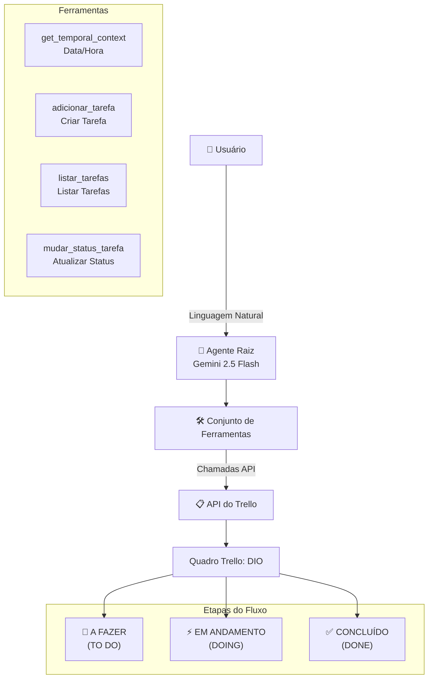

# 🤖 Agente Gestor de Tarefas do Trello

> Um agente inteligente alimentado por IA, construído com o Google Agent Development Kit (ADK), que se integra ao Trello para organização automatizada de tarefas diárias.

[](https://www.python.org/)
[](https://ai.google.dev/)

---

## 📋 Índice

- [Visão Geral](#visão-geral)
- [Arquitetura](#arquitetura)
- [Funcionalidades](#funcionalidades)
- [Estrutura do Projeto](#estrutura-do-projeto)
- [Instalação](#instalação)
- [Configuração](#configuração)
- [Uso](#uso)
- [Referência da API](#referência-da-api)
- [Licença](#licença)

---

## Visão Geral

Este projeto implementa um **agente inteligente** que ajuda os usuários a organizar suas tarefas diárias através de conversa natural. O agente se integra ao **Trello** para criar, gerenciar e acompanhar tarefas em um quadro dedicado chamado **"DIO"**.

### Funcionalidades Principais

- 🎤 **Interface Conversacional** - Interação em linguagem natural para gerenciamento de tarefas
- 📝 **Criação Automática de Tarefas** - Cria cards do Trello a partir de entrada do usuário
- 🔄 **Gerenciamento de Status** - Move tarefas pelas etapas do fluxo de trabalho
- 🔍 **Listagem de Tarefas** - Consulta tarefas por status ou visualiza todas

---

## Arquitetura



---

## Funcionalidades

| Funcionalidade | Descrição |
|----------------|----------|
| **Criação de Tarefas** | Adicionar novas tarefas com nome, descrição e data de vencimento |
| **Listagem de Tarefas** | Visualizar todas as tarefas ou filtrar por status |
| **Atualização de Status** | Mover tarefas entre A FAZER → EM ANDAMENTO → CONCLUÍDO |
| **Contexto Temporal** | Rastreamento automático de data/hora para organização de tarefas |

---

## Estrutura do Projeto

```
.
├── agenttaskmanager/
│   ├── __init__.py          # Inicialização do pacote
│   ├── agent.py              # Implementação principal do agente
│   └── .env                  # Variáveis de ambiente (chaves de API)
├── .adk/                     # Configuração do Google ADK
├── requirements.txt          # Dependências Python
├── .gitignore                # Regras de ignorância do Git
└── venv/                     # Ambiente virtual Python
```

---

## Instalação

### Pré-requisitos

- Python 3.8 ou superior
- Credenciais da API do Trello (Chave da API, Segredo da API, Token)
- Chave da API do Google AI

### Passos

1. **Clonar o repositório**
   ```bash
   git clone <url-do-repositorio>
   cd LabCriandoAgenteAutomatizarFluxoTrabalho
   ```

2. **Criar ambiente virtual**
   ```bash
   python -m venv venv
   ```

3. **Ativar ambiente virtual**
   ```bash
   # Windows
   venv\Scripts\activate
   
   # Linux/macOS
   source venv/bin/activate
   ```

4. **Instalar dependências**
   ```bash
   pip install -r requirements.txt
   ```

5. **Configurar variáveis de ambiente**
   Crie ou atualize `agenttaskmanager/.env`:
   ```env
   GOOGLE_GENAI_USE_VERTEXAI=0
   GOOGLE_API_KEY=sua_chave_api_google
   TRELLO_API_KEY=sua_chave_api_trello
   TRELLO_API_SECRET=seu_segredo_api_trello
   TRELLO_TOKEN=seu_token_trello
   ```

---

## Configuração

### Configuração do Trello

1. Faça login na sua conta do Trello
2. Acesse [Trello Power-Up Admin](https://trello.com/power-ups/admin)
3. Crie um novo Power-Up ou use credenciais existentes
4. Obtenha sua Chave da API, Segredo da API e Token

### Quadro do Trello Necessário

O agente espera um quadro do Trello chamado **"DIO"** com as seguintes listas:
- `A FAZER` ou `TO DO` - Para tarefas novas
- `EM ANDAMENTO` ou `DOING` - Para tarefas em progresso
- `CONCLUÍDO` ou `DONE` - Para tarefas concluídas

---

## Uso

### Executando o Agente

```bash
# Usando o CLI do Google ADK
adk run agenttaskmanager.agent
```

### Comportamento do Agente

Quando ativado, o agente:
1. Saúda o usuário com a data/hora atual
2. Pergunta sobre as tarefas do dia
3. Cria cards na lista A FAZER do Trello
4. Continua perguntando por mais tarefas até que o usuário termine

### Exemplo de Conversa

```
Agente: Bom dia! Hoje é 29/03/2026 14:42:28. Quais tarefas você tem para hoje?

Usuário: Preciso terminar o relatório do projeto

Agente: Adicionado "Terminar o relatório do projeto" na sua lista A FAZER. Mais alguma tarefa?

Usuário: Não, é só isso

Agente: Ótimo! Você tem 1 tarefa organizada para hoje.
```

---

## Referência da API

### Ferramentas

#### `get_temporal_context()`

Retorna a data e hora atual formatada como `AAAA/MM/DD HH:MM:SS`.

```python
from agenttaskmanager.agent import get_temporal_context

contexto = get_temporal_context()  # Retorna: "2026/03/29 14:42:28"
```

#### `adicionar_tarefa(nome_da_task, descricao_da_task, due_date)`

Cria um novo card de tarefa na lista A FAZER do Trello.

```python
from agenttaskmanager.agent import adicionar_tarefa

adicionar_tarefa(
    nome_da_task="Completar relatório",
    descricao_da_task="Finalizar relatório financeiro do Q1",
    due_date="2026-03-30"
)
```

#### `listar_tarefas(status="todas")`

Lista tarefas com filtragem opcional.

```python
from agenttaskmanager.agent import listar_tarefas

# Todas as tarefas
todas_tarefas = listar_tarefas()

# Filtrar por status
tarefas_a_fazer = listar_tarefas(status="a fazer")
tarefas_andamento = listar_tarefas(status="em andamento")
tarefas_concluidas = listar_tarefas(status="concluido")
```

#### `mudar_status_tarefa(nome_da_task, novo_status)`

Move uma tarefa para uma etapa diferente do fluxo de trabalho.

```python
from agenttaskmanager.agent import mudar_status_tarefa

resultado = mudar_status_tarefa(
    nome_da_task="Completar relatório",
    novo_status="em andamento"
)
# Retorna: "Tarefa 'Completar relatório' movida para 'em andamento'."
```

---

## Dependências

| Pacote | Finalidade |
|--------|------------|
| `google-adk` | Framework do Agent Development Kit |
| `py-trello` | Cliente Python da API do Trello |
| `python-dotenv` | Gerenciamento de variáveis de ambiente |

---

