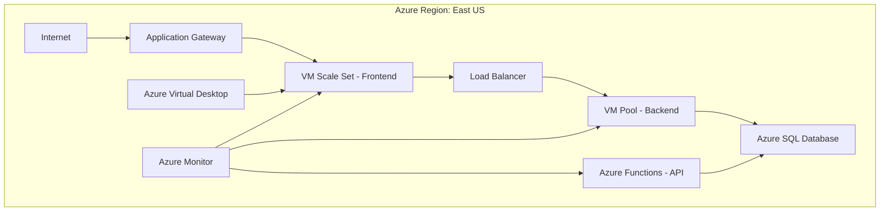

# Configurando Recursos e Dimensionamentos em Máquinas Virtuais na Azure - AZ-900

[](https://docs.microsoft.com/azure)
[](https://github.com/seu-usuario/azure-vm-dimensionamento)


## 📋 Resumo do Tema

Este projeto aborda os conceitos fundamentais de **recursos e dimensionamento de máquinas virtuais (VMs) no Microsoft Azure**, essenciais para a certificação **AZ-900**. Você aprenderá a criar, configurar, dimensionar e gerenciar VMs de forma eficiente, além de explorar serviços relacionados como escalas automáticas, pools de hosts e áreas de trabalho virtuais.

### Conceitos Principais:
- **Máquinas Virtuais (VMs)**: Computação escalonável na nuvem
- **Dimensionamento**: Ajuste de capacidade conforme demanda
- **Pools de Hosts**: Agrupamento de recursos para gerenciamento centralizado
- **Área de Trabalho Virtual**: Experiência de desktop remoto na nuvem
- **Funções Azure**: Computação serverless para microsserviços

---

## 🚀 Guia Passo a Passo

### 1️⃣ Criando e Configurando uma Máquina Virtual no Azure Portal

#### **Pré-requisitos:**
- Assinatura ativa do Azure
- Grupo de recursos criado

#### **Passos Detalhados:**

```bash
# 1. Acesse o Portal do Azure (portal.azure.com)
# 2. Clique em "Criar um recurso" → "Computação" → "Máquina virtual"
```

**Configurações Básicas:**
- **Assinatura**: Selecione sua assinatura ativa
- **Grupo de recursos**: Selecione ou crie um novo
- **Nome da VM**: `vm-producao-001`
- **Região**: East US (ou sua região preferida)
- **Imagem**: Ubuntu Server 20.04 LTS ou Windows Server 2022
- **Tamanho**: Standard_B2s (2 vCPUs, 4GB RAM)
- **Nome de usuário**: `azureuser`
- **Tipo de autenticação**: Chave SSH (Linux) ou Senha (Windows)

**Configurações de Disco:**
- **Disco do SO**: Premium SSD (30 GB mínimo)
- **Discos de dados**: Adicionar disco de 100 GB se necessário

**Rede:**
- **Rede virtual**: Criar nova ou usar existente
- **Sub-rede**: Padrão (10.0.0.0/24)
- **IP público**: Criar novo (SKU Básico)
- **Portas de entrada**: SSH (22) ou RDP (3389)

**Gerenciamento:**
- **Monitoramento**: Habilitar Diagnóstico de Inicialização
- **Backup**: Habilitar backup automático

```bash
# 3. Revisar e criar
# 4. Aguarde a implantação (5-10 minutos)
# 5. Acesse: ssh azureuser@<IP_PUBLICO>
```

---

### 2️⃣ Configuração de Escala (Scale Sets e Auto Scaling)

#### **O que é:**
O **Virtual Machine Scale Sets (VMSS)** permite criar e gerenciar um grupo de VMs de carga balanceada, com dimensionamento automático baseado em métricas.

#### **Criando um Scale Set:**

```bash
# Via Portal:
# 1. Criar recurso → "Scale Set de Máquina Virtual"
# 2. Configurar:
#    - Nome: ss-webapp-prod
#    - Instâncias: 2 (inicial)
#    - Tamanho: Standard_B2s
#    - Balanceador de carga: Sim
```

#### **Regras de Auto Scaling:**

```bash
# Via CLI Azure:
az monitor autoscale create \
  --resource-group meu-rg \
  --resource ss-webapp-prod \
  --resource-type Microsoft.Compute/virtualMachineScaleSets \
  --name autoscale-webapp \
  --min-count 2 \
  --max-count 10 \
  --count 2

# Regra: Escala para cima quando CPU > 70%
az monitor autoscale rule create \
  --autoscale-name autoscale-webapp \
  --condition "Percentage CPU > 70 avg 5m" \
  --scale out 2

# Regra: Escala para baixo quando CPU < 30%
az monitor autoscale rule create \
  --autoscale-name autoscale-webapp \
  --condition "Percentage CPU < 30 avg 10m" \
  --scale in 1
```

**Métricas de Escalonamento:**
- Percentual de CPU
- Fila de mensagens
- Consumo de memória
- Latência de requisições

---

### 3️⃣ Selecionando o Tamanho da Máquina Virtual

#### **Famílias de Tamanhos Azure:**

| Família | Uso Ideal | Exemplo | vCPUs | RAM | Custo |
|---------|-----------|---------|-------|-----|-------|
| **B-series** | Desenvolvimento/Prototipação | Standard_B2s | 2 | 4GB | $ |
| **D-series** | Uso Geral | Standard_D2s_v3 | 2 | 8GB | $$ |
| **E-series** | Memória Otimizada | Standard_E4s_v3 | 4 | 32GB | $$$ |
| **F-series** | CPU Otimizada | Standard_F4s_v2 | 4 | 8GB | $$ |
| **M-series** | Memória Crítica | Standard_M8ms | 8 | 219GB | $$$$ |

#### **Como Escolher:**

**Para Aplicações Web:**
```bash
# Standard_B2s (desenvolvimento)
# Standard_D2s_v3 (produção leve)
# Standard_D4s_v3 (produção média)
```

**Para Bancos de Dados:**
```bash
# Standard_E4s_v3 (SQL Server)
# Standard_E8s_v3 (PostgreSQL/MySQL)
```

**Para Computação Intensiva:**
```bash
# Standard_F8s_v2 (containers)
# Standard_H8 (HPC - High Performance Computing)
```

**Ferramenta de Ajuda:**
```bash
# Via CLI: az vm list-sizes --location eastus --output table
```

---

### 4️⃣ Criando um Pool de Hosts (Host Pools - Azure Virtual Desktop)

#### **O que é:**
Um **Pool de Hosts** agrupa máquinas virtuais que fornecem experiência de desktop remoto.

#### **Passo a Passo:**

```bash
# 1. No Portal: procure por "Área de Trabalho Virtual do Azure"
# 2. Clique em "Host pools" → "Criar"
```

**Configurações:**
- **Nome do Pool**: `hp-desenvolvimento`
- **Tipo de Pool**: Pooled (compartilhado) ou Personal (dedicado)
- **Imagem**: Windows 10 Enterprise Multi-Session
- **Tamanho da VM**: Standard_D4s_v3
- **Número de VMs**: 3
- **Local**: East US

**Configuração de Rede:**
```bash
# Rede virtual: vnet-avd-001 (10.1.0.0/16)
# Sub-rede: subnet-avd (10.1.1.0/24)
# Gateway de aplicativo: Para acesso externo seguro
```

**Registro no Pool:**
```bash
# Após criar as VMs, registre-as no pool:
# Copie o token de registro gerado
# Execute no VM: 
New-AzWvdRegistrationInfo -HostPoolName hp-desenvolvimento -ResourceGroupName rg-avd -ExpirationTime $((Get-Date).AddDays(30))
```

---

### 5️⃣ Explorando a Área de Trabalho Virtual do Azure (Virtual Desktop)

#### **Componentes:**
1. **Host Pools**: Agrupamento de VMs
2. **Application Groups**: Agrupamento de apps
3. **Workspaces**: Ambiente de trabalho do usuário
4. **Perfis de Usuário**: FSLogix para persistência

#### **Experiência do Usuário:**

```bash
# 1. Baixe o cliente Azure Virtual Desktop
#    - Windows: Microsoft Store
#    - macOS: App Store
#    - Android/iOS: Respectivas lojas

# 2. Conectar:
#    - Workspace URL: https://rdweb.wvd.microsoft.com
#    - Credenciais: azureuser@suaempresa.com
```

**Vantagens:**
- Acesso remoto seguro
- Desktop persistente
- Escalabilidade automática
- Custo reduzido (pague por uso)

---

### 6️⃣ Criando um Aplicativo de Funções (Azure Functions)

#### **O que é Azure Functions:**
Computação serverless que executa código sob demanda sem provisionar servidores.

#### **Criando via Portal:**

```bash
# 1. Criar recurso → "Função do Azure"
# 2. Configurar:
#    - Nome do aplicativo: func-api-produtos
#    - Plano de hospedagem: Consumo (serverless)
#    - Runtime: Node.js 18 ou .NET 6
#    - Região: East US
```

#### **Criando Função HTTP (Exemplo Node.js):**

```javascript
// function.json
{
  "bindings": [
    {
      "authLevel": "function",
      "type": "httpTrigger",
      "direction": "in",
      "name": "req",
      "methods": ["get", "post"]
    },
    {
      "type": "http",
      "direction": "out",
      "name": "res"
    }
  ]
}

// index.js
module.exports = async function (context, req) {
    context.log('Função de produtos chamada!');
    
    const produtos = [
        { id: 1, nome: "Notebook", preco: 3500 },
        { id: 2, nome: "Mouse", preco: 50 }
    ];
    
    context.res = {
        status: 200,
        body: produtos
    };
};
```

#### **Testando:**

```bash
# Via CURL:
curl https://func-api-produtos.azurewebsites.net/api/HttpTrigger1?code=YOUR_KEY

# Resposta:
# [{"id":1,"nome":"Notebook","preco":3500},{"id":2,"nome":"Mouse","preco":50}]
```

---

## 📊 Boas Práticas Recomendadas

### **Segurança:**
- 🔒 Use NSGs (Network Security Groups)
- 🔑 SSH Key para Linux, Azure AD para Windows
- 🔐 Criptografia de disco habilitada
- 🛡️ Azure Security Center ativado

### **Custos:**
- 💰 Use B-series para dev/test
- 💡 Auto-shutdown fora do horário comercial
- 📊 Budget alerts no Azure Cost Management
- ♻️ Reserve instâncias para produção

### **Performance:**
- ⚡ Use Managed Disks (Premium SSD)
- 🔄 Availability Zones para HA
- 📈 Monitoramento com Azure Monitor
- 🎯 Application Gateway para balanceamento

---

## 🎯 Exemplo de Arquitetura Completa



---

## 📚 Recursos Oficiais

- [Documentação VMs Azure](https://docs.microsoft.com/azure/virtual-machines/)
- [Azure Virtual Desktop](https://docs.microsoft.com/azure/virtual-desktop/)
- [Azure Functions](https://docs.microsoft.com/azure/azure-functions/)
- [Azure Architecture Center](https://docs.microsoft.com/azure/architecture/)

---

## 🎓 Conclusão

Após completar este guia, aprendi a:
- ✅ Criar e gerenciar VMs no Azure proficientemente
- ✅ Implementar dimensionamento automático
- ✅ Otimizar custos com tamanhos adequados
- ✅ Provisionar pools de hosts para VDI
- ✅ Desenvolver soluções serverless com Functions
- ✅ Monitorar e manter recursos na nuvem Microsoft

---
