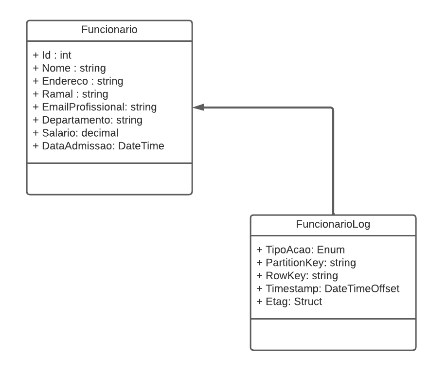
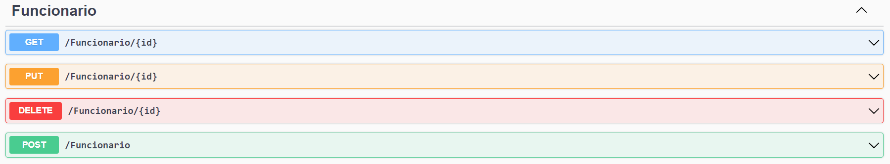
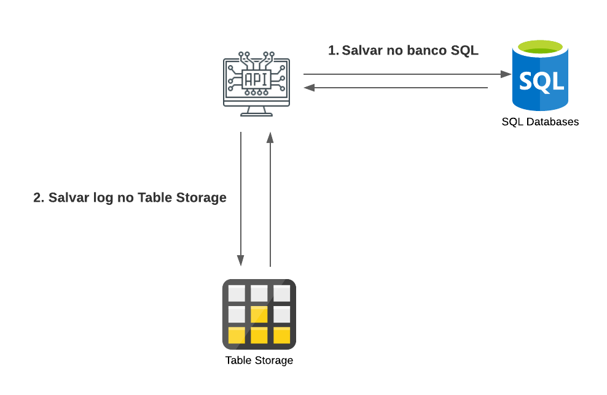

# DIO - Trilha .NET - Nuvem com Microsoft Azure
www.dio.me

## Desafio de projeto
Desenvolver uma Web API para um sistema de RH com operações CRUD de funcionários, armazenando logs de todas as alterações no Azure Table Storage. A aplicação deve ser implantada no Microsoft Azure utilizando App Service, SQL Database e Azure Table.

## Contexto
Construir um sistema de RH, onde para essa versão inicial do sistema o usuário poderá cadastrar os funcionários de uma empresa. 

Essa cadastro precisa precisa ter um CRUD, ou seja, deverá permitir obter os registros, criar, salvar e deletar esses registros. A sua aplicação também precisa armazenar logs de toda e qualquer alteração que venha a ocorrer com um funcionário.

## Premissas
A aplicação deverá ser do tipo Web API, Azure Functions ou MVC, fique a vontade para implementar a solução que achar mais adequado.

A aplicação deverá ser implantada no Microsoft Azure, utilizando o App Service para a API, SQL Database para o banco relacional e Azure Table para armazenar os logs.

A aplicação deverá armazenar os logs de todas as alterações que venha a acontecer com o funcionário. Os logs deverão serem armazenados em uma Azure Table.

A classe principal, a classe Funcionario e a FuncionarioLog, deve ser a seguinte:



A classe FuncionarioLog é filha da classe Funcionario, pois o log terá as mesmas informações da Funcionario.
É necessário gerar a sua migration para atualização no banco de dados.

## Métodos esperados
Conforme a seguir:


**Swagger**





**Endpoints**


| Verbo  | Endpoint                | Parâmetro | Body               |
|--------|-------------------------|-----------|--------------------|
| GET    | /Funcionario/{id}       | id        | N/A                |
| PUT    | /Funcionario/{id}       | id        | Schema Funcionario |
| DELETE | /Funcionario/{id}       | id        | N/A                |
| POST   | /Funcionario            | N/A       | Schema Funcionario |

Esse é o schema (model) de Funcionario, utilizado para passar para os métodos que exigirem:

```json
{
  "nome": "Nome funcionario",
  "endereco": "Rua 1234",
  "ramal": "1234",
  "emailProfissional": "email@email.com",
  "departamento": "TI",
  "salario": 1000,
  "dataAdmissao": "2022-06-23T02:58:36.345Z"
}
```

## Ambiente
Este é um diagrama do ambiente que deverá ser montado no Microsoft Azure, utilizando o App Service para a API, SQL Database para o banco relacional e Azure Table para armazenar os logs.




## Implementação Concluída

A solução foi implementada completando todos os TODOs pendentes no [`FuncionarioController.cs`](Controllers/FuncionarioController.cs):

### Alterações Realizadas

1. **Método POST (Criar)** - [`Criar()`](Controllers/FuncionarioController.cs:44):
   - Adicionado `_context.SaveChanges()` para persistir o funcionário no banco SQL
   - Adicionado `tableClient.UpsertEntity(funcionarioLog)` para salvar o log no Azure Table

2. **Método PUT (Atualizar)** - [`Atualizar()`](Controllers/FuncionarioController.cs:57):
   - Completadas todas as propriedades faltantes: `Ramal`, `EmailProfissional`, `Departamento`, `Salario`, `DataAdmissao`
   - Adicionado `_context.Funcionarios.Update(funcionarioBanco)` para atualizar no banco SQL
   - Adicionado `tableClient.UpsertEntity(funcionarioLog)` para salvar o log no Azure Table

3. **Método DELETE (Deletar)** - [`Deletar()`](Controllers/FuncionarioController.cs:84):
   - Adicionado `_context.Funcionarios.Remove(funcionarioBanco)` para remover do banco SQL
   - Adicionado `tableClient.UpsertEntity(funcionarioLog)` para salvar o log no Azure Table

### Arquitetura

- **Web API** com ASP.NET Core 6.0
- **Banco de dados**: SQL Database (Azure) para armazenar funcionários
- **Logs**: Azure Table Storage para armazenar histórico de alterações
- **ORM**: Entity Framework Core com migrations

### Configuração Necessária

Para executar a aplicação, configure as seguintes chaves em [`appsettings.json`](appsettings.json):

```json
{
  "ConnectionStrings": {
    "ConexaoPadrao": "string de conexão do SQL Database",
    "SAConnectionString": "string de conexão do Azure Storage",
    "AzureTableName": "FuncionarioLog"
  }
}
```

### Executando Localmente

```bash
dotnet restore
dotnet build
dotnet run
```

Acesse o Swagger em: `https://localhost:5001/swagger`