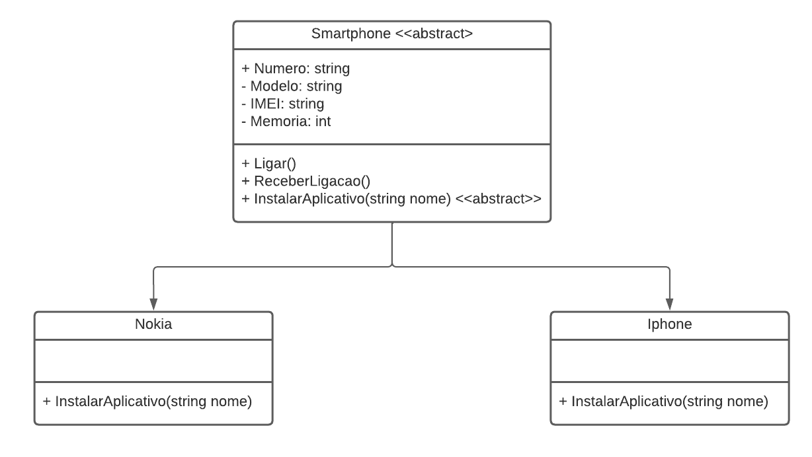

# DIO - Trilha .NET - Programação orientada a objetos
www.dio.me

## Desafio de projeto
Para este desafio, você precisará usar seus conhecimentos adquiridos no módulo de orientação a objetos, da trilha .NET da DIO.

## Contexto
Você é responsável por modelar um sistema que trabalha com celulares. Para isso, foi solicitado que você faça uma abstração de um celular e disponibilize maneiras de diferentes marcas e modelos terem seu próprio comportamento, possibilitando um maior reuso de código e usando a orientação a objetos.

## Proposta
Você precisa criar um sistema em .NET, do tipo console, mapeando uma classe abstrata e classes específicas para dois tipos de celulares: Nokia e iPhone. 
Você deve criar as suas classes de acordo com o diagrama abaixo:



## Regras e validações
1. A classe **Smartphone** deve ser abstrata, não permitindo instanciar e servindo apenas como modelo.
2. A classe **Nokia** e **Iphone** devem ser classes filhas de Smartphone.
3. O método **InstalarAplicativo** deve ser sobrescrito na classe Nokia e iPhone, pois ambos possuem diferentes maneiras de instalar um aplicativo.

## Solução
O código está pela metade, e você deverá dar continuidade obedecendo as regras descritas acima, para que no final, tenhamos um programa funcional. Procure pela palavra comentada "TODO" no código, em seguida, implemente conforme as regras acima.

## Implementação realizada ✅
A seguir está um resumo das alterações que implementei para completar o desafio:

- **Classe abstrata `Smartphone`**
  - Tornada abstrata e adicionadas **propriedades**: `Numero`, `Modelo`, `Imei`.
  - **Construtor** recebe `numero`, `modelo` e `imei` e inicializa as propriedades.
  - Métodos concretos: `Ligar()` e `ReceberLigacao()`.
  - Método abstrato: `InstalarAplicativo(string nomeApp)` para ser sobrescrito por subclasses.

- **Classe `Iphone`** (herda `Smartphone`) 🔧
  - Construtor que chama `base(numero, modelo, imei)`.
  - Sobrescreve `InstalarAplicativo` exibindo: `Instalando aplicativo {nomeApp} pela App Store`.

- **Classe `Nokia`** (herda `Smartphone`) 🔧
  - Construtor que chama `base(numero, modelo, imei)`.
  - Sobrescreve `InstalarAplicativo` exibindo: `Instalando aplicativo {nomeApp} pela Play Store`.

- **`Program.cs`**
  - Incluí um exemplo simples que instancia um `Iphone` e um `Nokia`, chama `Ligar()`, `ReceberLigacao()` e `InstalarAplicativo()` para demonstrar o comportamento polimórfico.

## Como testar 🧪
1. Abra o terminal na pasta do projeto.
2. Rode `dotnet build` para compilar.
3. Rode `dotnet run` para executar. Você deverá ver uma saída similar a:

```
=== Demonstração: Abstraindo Celular ===
Ligando...
Instalando aplicativo WhatsApp pela App Store
Recebendo ligação...
Instalando aplicativo Snake pela Play Store
```
